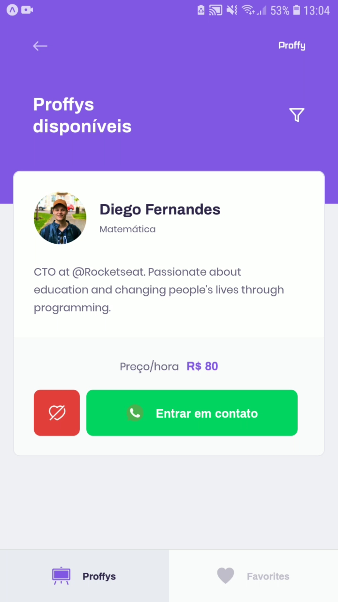
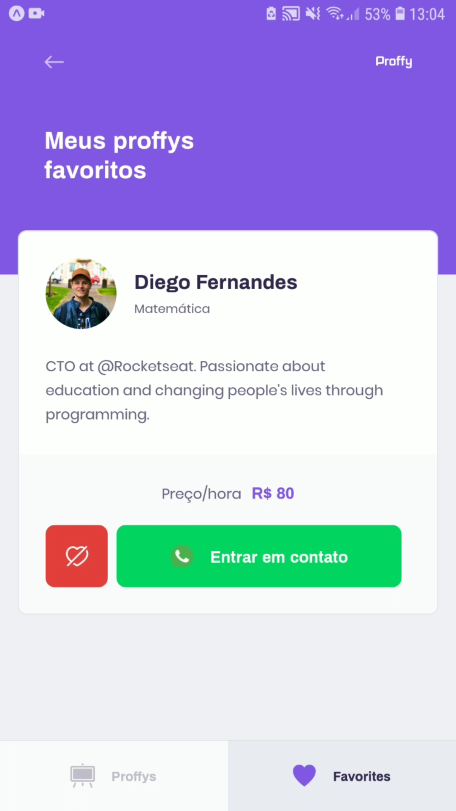

<div align="center" >
    

## 🚀💜 Sua plataforma de estudos online.
    
</div>


## 📱 Demonstração do Projeto

<div align="center" >
    
    
    
    
</div>

## 📑 Sobre

Aplicação mobile construída na NLW (Next Level Week) #2 da [Rocketseat](https://github.com/Rocketseat).

- Android e IOS


## ♻ Recursos

- Plataforma mobile, para listagem de professores
- Salvar professores favoritos
- Entrar em contato com os professores


## 👨‍💻 Tecnologias 

O projeto foi desenvolvido utilizando

- ReactNative
- TypeScript
- Expo


## ⚠ Requisitos

Para executar esse projeto, antes você precisa seguir os passos para baixar e rodar a API. 

[Baixe a API aqui.](https://github.com/xpedroleonardo/Proffy-Server)


## ⬇ Como baixar o projeto

```bash

    #Clonar o Repositório (Via Terminal)
    $ git clone https://github.com/xpedroleonardo/Proffy-Mobile.git

    #Ou

    #Botão verde acima (Zip)
    Baixar projeto compactado

```


## 🚀 Como executar o projeto


Para executar o projeto, você precisa de um telefone celular com o aplicativo <strong>expo</strong> instalado ou um emulador android / ios.

App Expo :  [Android](https://play.google.com/store/apps/details?id=host.exp.exponent&hl=pt_BR) | [IOS](https://apps.apple.com/br/app/expo-client/id982107779)


Dentro da pasta do projeto, execute os seguintes comandos:

```bash

    #Entrar na pasta do projeto
    $ cd Proffy-Mobile/

    #Instalar as depedências (npm ou yarn)
    $ npm | yarn install

    #Executando o Projeto (npm ou yarn)
    $ npm | yarn start

```

Após executar esses comandos, aparecerá um QRCode, leia ele com o app do expo ou rode o projeto emulador.


## ⚠ Atenção !!!

Se você fechar o terminal que o projeto está sendo executado, ele irá parar de funcionar, e isso vai impedir que que você utilize a aplicação Moblile.

Deixe o terminal aberto após rodar os comandos para executar o projeto.

---

### 💻 Feito por [Pedro Leonardo](https://github.com/xpedroleonardo). 

### Gostou do projeto ? De uma estrela ⭐